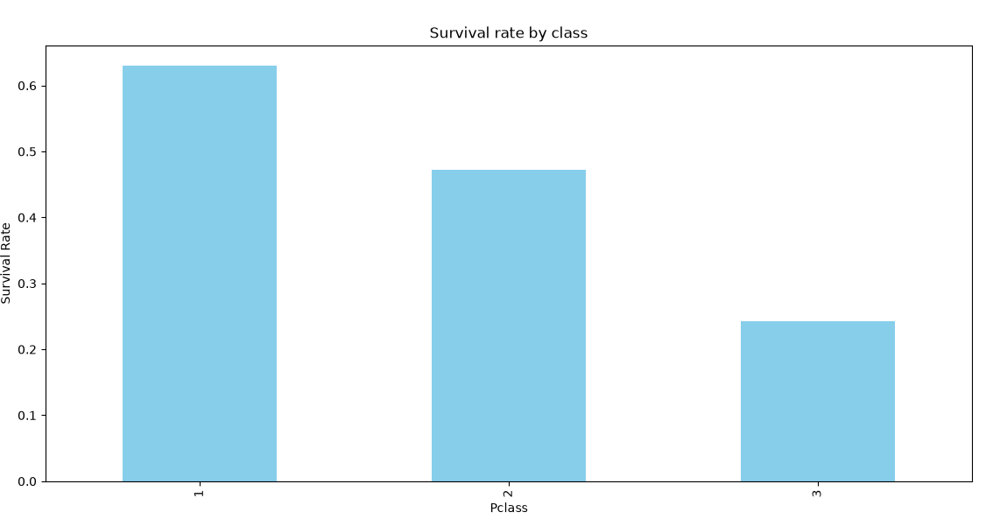
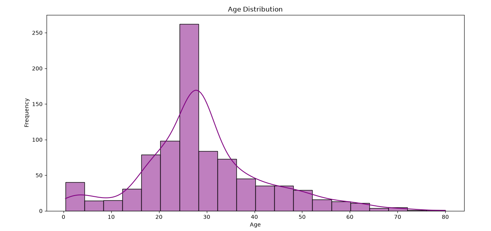
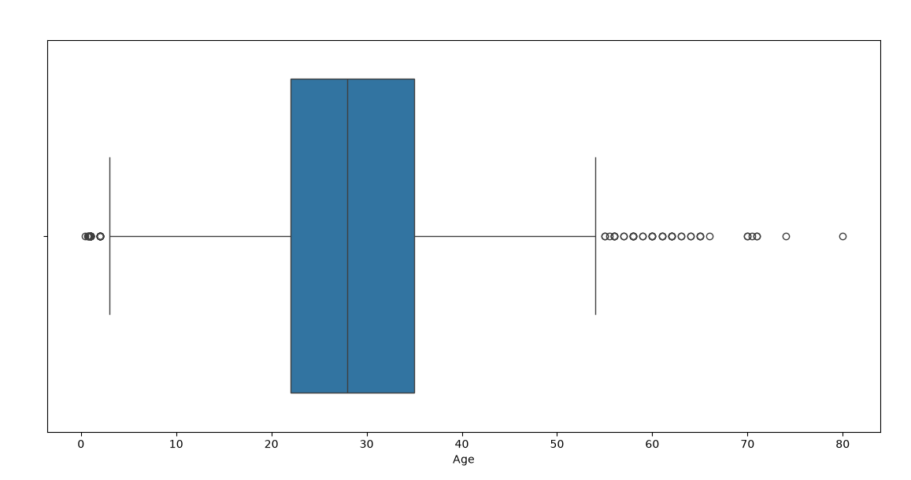

# Titanic Dataset EDA Report

## 1. Overview:
  - Dateset contains 891 rows and 12 columns.
  - Missing values handled for 'Age' (filled with median), 'Embarked' (filled with mode), and 'Cabin' (filled using backward fill).

## 2. Key Insights:
  - Survival rates are highest for first-class passangers (62%) and lowest for thired-class passangers (24%).
  - Majority of passangers are aged between age 20-40 years.
  - A positive correlation exists between fare and survival.

## 3. Visual Insights:
  ## Bar Chart

## Histogram

## Scatter Plot

## Box Plot

